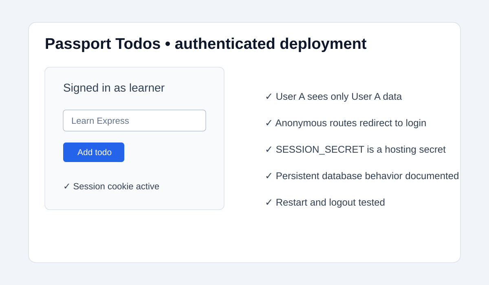

# Beginner Tutorial: Passport Todos (2026-08-10)

This tutorial introduces server-side sessions and SQLite through a compact authenticated todo app instead of another RealWorld article.

Reference project: https://github.com/passport/todos-express-password

## What you will build

An Express application where a user signs in, sees only their own todos, and can create, complete, and delete them. The important lesson is authorization: every todo query must be scoped to the authenticated user.

## Local deployment

```bash
git clone https://github.com/passport/todos-express-password.git
cd todos-express-password
npm install
npm test
npm start
```

Follow the repository README if its current start or test script differs. Open the local URL, create a test account, add a todo, sign out, and confirm that a second account cannot see it.

## Security walkthrough

- Use Passport's documented strategy and never store plaintext passwords.
- Keep the session secret in an environment variable.
- Use parameterized SQLite queries.
- Add authorization checks to read, update, and delete routes, not only the UI.
- Set secure cookies in production and serve the app over HTTPS.

## Production deployment: Render

1. Create a Render Web Service from your fork.
2. Use the repository's documented install and start commands; run tests in CI before deploying.
3. Add a long random `SESSION_SECRET` in Render's environment settings.
4. Choose persistent storage for SQLite if the platform and plan support it; otherwise migrate to a managed database before treating the deployment as durable.
5. Configure `NODE_ENV=production` and any documented port behavior.
6. Deploy, inspect logs, and test registration, login, logout, create, complete, delete, and unauthorized access.
7. Verify that secrets are absent from the repository and that the app responds correctly after a restart.

## Screenshot



## Verification checklist

- Passwords are hashed by the reference implementation.
- Anonymous users cannot access protected todo routes.
- User A cannot read or mutate User B's records.
- Session cookies use production security settings.
- Persistent database behavior is documented before launch.

Respect the upstream Unlicense and current README when adapting the example.