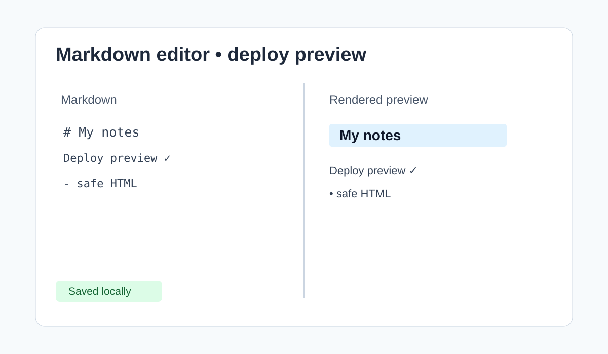

# Beginner Tutorial: StackEdit Markdown Editor (2026-08-08)

This entry replaces another RealWorld repetition with a focused client-side editor project.

Reference project: https://github.com/benweet/stackedit
Live site: https://stackedit.io/

## What you will learn

Build and deploy a Markdown writing workflow: controlled text input, rendered preview, autosave, and static hosting. Start with one document before adding synchronization providers.

## Local deployment

```bash
git clone https://github.com/benweet/stackedit.git
cd stackedit
npm install
npm test
npm run build
npm start
```

Check the repository README if the current scripts differ. Open the local URL and test headings, links, code blocks, and an intentionally malformed Markdown sample.

## Implementation lessons

- Keep raw Markdown as the source of truth; derive the preview from it.
- Sanitize rendered HTML before inserting it into the page.
- Debounce autosave to localStorage and show a saved/unsaved indicator.
- Keep cloud integrations disabled until their OAuth and privacy requirements are understood.

## Production deployment: Netlify

1. Fork the repository and create a Netlify site from the fork.
2. Set the build command to the repository's documented production build command, commonly `npm run build`.
3. Set the publish directory to the directory produced by the build (inspect the build output; do not guess it).
4. Add only public configuration values in Netlify environment settings; keep tokens out of the browser bundle.
5. Deploy, open the generated URL, and verify editor input, preview rendering, refresh behavior, and browser console errors.
6. Enable deploy previews so future changes can be reviewed before production.

## Screenshot



## Verification checklist

- Preview updates without executing arbitrary HTML.
- Refresh does not silently lose a saved local draft.
- Large documents remain usable and the build has no warnings that affect deployment.
- OAuth or sync features are not enabled with placeholder credentials.

Reference the upstream Apache-2.0 license and current README for exact commands.