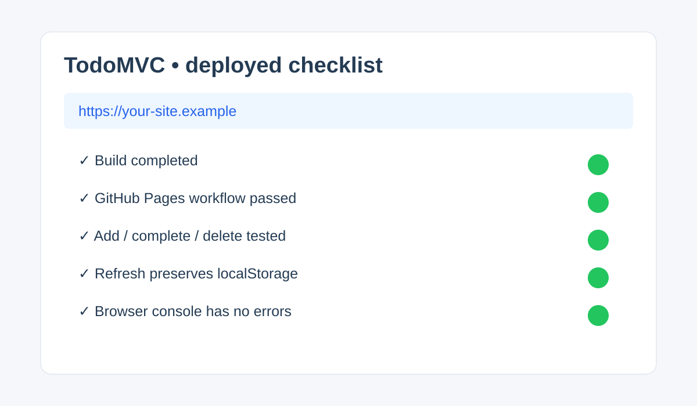

# Beginner Tutorial: TodoMVC (2026-08-04)

This fills the missing daily entry with a project that is intentionally smaller than RealWorld: a task list that teaches DOM events, state, filtering, and tests.

Reference project: https://github.com/dwyl/javascript-todo-list-tutorial
Live example: https://dwyl.github.io/javascript-todo-list-tutorial

## What you will build

A browser todo list with add, complete, delete, filter, and local persistence. Keep the first version framework-free so every state transition is visible.

## Prerequisites

Install Git, Node.js 20 or newer, and a modern browser.

## Local deployment

```bash
git clone https://github.com/dwyl/javascript-todo-list-tutorial.git
cd javascript-todo-list-tutorial
npm install
npm test
npm start
```

If the repository's current README uses a different script, use its documented command. Open the printed localhost URL, add three tasks, complete one, refresh, and verify persistence. Never commit node_modules.

## Beginner implementation plan

1. Start with an array of `{id, title, completed}` objects.
2. Render the array after every mutation instead of editing scattered DOM nodes.
3. Delegate click and submit events from the list container.
4. Save JSON to localStorage after each change and recover gracefully from invalid JSON.
5. Add tests for adding, completing, deleting, and filtering before styling.

## Production deployment: GitHub Pages

1. Push your fork to GitHub and enable Pages for the branch/directory containing the built static files.
2. If a build is required, run `npm run build` and configure the Pages workflow to publish its output directory.
3. In repository Settings > Pages, select GitHub Actions or the documented branch source.
4. Wait for the workflow, then open the generated Pages URL from the deployment summary.
5. Test a hard refresh on the task route, localStorage persistence, and the browser console.

## Screenshot



## Verification checklist

- Empty input is rejected without creating a blank task.
- Refresh preserves tasks but does not expose secrets.
- Keyboard submit works and completed tasks remain filterable.
- `npm test` passes before deployment.

This tutorial is educational; follow the reference repository's current license and scripts.