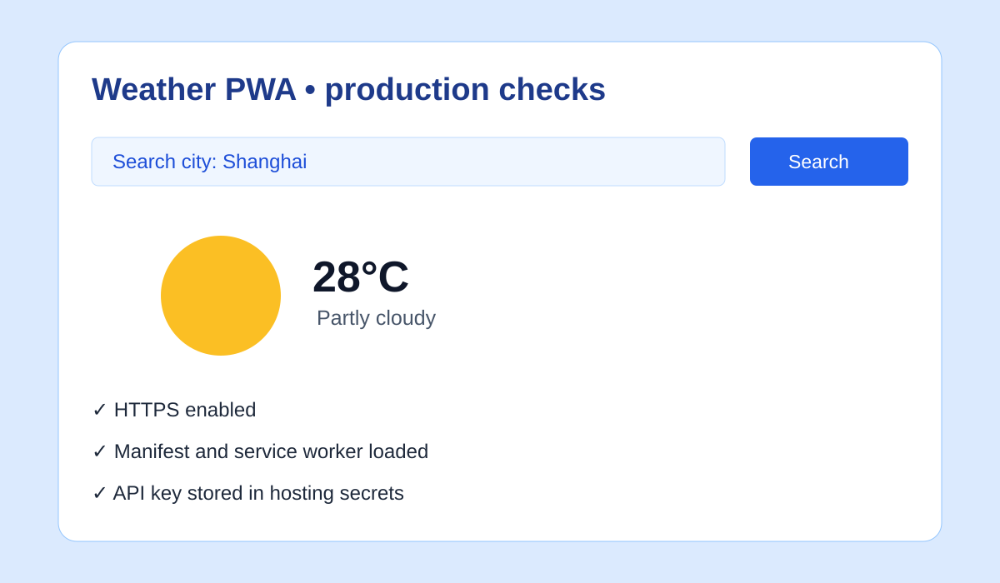

# Beginner Tutorial: Weather PWA (2026-08-09)

A beginner-friendly API and Progressive Web App exercise, distinct from the repository's repeated RealWorld articles.

Reference project: https://github.com/adrianhajdin/project_weather_pwa
Example deployment listed by the project: https://inspiring-bhaskara-d21f88.netlify.app

## What you will build

A responsive weather search with loading, error, and empty states, plus a service worker and installable PWA shell.

## Local deployment

```bash
git clone https://github.com/adrianhajdin/project_weather_pwa.git
cd project_weather_pwa
npm install
cp .env.example .env  # only if supplied by the project
# Add the weather API key required by the README
npm start
```

Use the exact variable name documented by the project and keep `.env` out of Git. Test a known city, an unknown city, offline startup, and a rejected API request.

## Learning path

1. Separate query state from weather-result state.
2. Show a loading indicator while the request is pending.
3. Convert API failures into a useful message instead of a blank screen.
4. Cache the app shell, but do not cache private keys or stale weather indefinitely.
5. Check the manifest name, icons, theme color, and service-worker scope.

## Production deployment: Netlify

1. Import your fork into Netlify.
2. Set the documented build command, usually `npm run build` for this React project.
3. Set the publish directory to the build output reported by the repository's build script.
4. Add the weather API key as a Netlify environment variable with the exact documented name.
5. Deploy and open the HTTPS URL; service workers require a secure context outside localhost.
6. Use DevTools Application > Manifest and Service Workers to verify installability, then run a Lighthouse check.
7. Confirm API errors, mobile layout, refresh, and a clean deploy without exposing the key in committed files.

## Screenshot



## Verification checklist

- Search, loading, success, empty, and error states are visible.
- HTTPS is enabled and the manifest loads.
- Offline behavior is honest: cached shell works, unavailable data is labeled.
- API quota and key restrictions are configured with the provider.